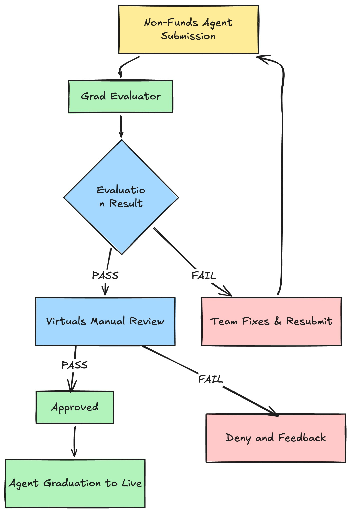

# Non-Funds Agent Graduation Evaluation SOP

## Purpose
Define the evaluation steps for non-funds agents using the ACP Graduation Evaluator.

## Audience
Virtuals Protocol Internal Team (Manual Review Phase)

## Overview
This SOP defines the evaluation flow for non-funds agents in ACP.

### Key Decision Gate
Only agents that pass automated evaluation receive Virtuals team review. Failed agents must be fixed.

### External Team Reporting
Passing agents include an Evaluation Report link in the graduation submission form.

---

## Part A: Automated Evaluation (Non-funds Agents)

### Part 1: Submission Intake
Evaluation starts when a team submits a graduation request through the designated channel.

Required inputs for pending evaluation:
- agent name
- agent wallet address

### Part 2: Pre-Evaluation Validation
Before running jobs, the evaluator checks the request has `agentName` and `agentWalletAddress`, then verifies identity on-chain.

The identity check uses fuzzy similarity matching with a threshold of **75%**:
- If the wallet address is correct but the agent name is incorrect -> Fail
- If the agent name is correct but the wallet address is incorrect -> Fail

### Part 3: Automated Job Execution
After validation, the evaluator runs test jobs against the agent.

Each test job is designed to validate:
- Schema adherence
- Input validation
- Execution stability
- Output correctness
- Error handling behavior

Jobs run in batches **per offering** (max 12 per batch) with safety delays. Inputs include valid and invalid cases (NSFW for content-gen, invalid enums for schema tests, real-time vs non-real-time for fact-check). 

If initiation fails due to schema validation, the evaluator logs the error and retries with corrected requirements.

### Metric-Based Evaluation
For each job in EVALUATION, the evaluator uses an LLM to assess the deliverable. For time-sensitive or URL-based content, it will use Google Search and/or URL context before deciding.

### Scoring and Threshold Assessment
Results are aggregated across all child jobs. Each job passes if the **actual phase** matches the **expected outcome** ("accept" vs "reject").

### Evaluation Report Generation
After all checks, the evaluator generates a structured report and uploads full details to Google Docs when credentials are configured. The delivered payload includes a compact summary and a shareable link (view link on success; edit link fallback).

The report includes:
- Agent name and identifier
- Evaluation timestamp
- Summary pass or fail status
- Detailed results per evaluation category
- Explicit failure reasons, if applicable
- Warnings or improvement notes, if applicable

### Final Automated Decision
The automated evaluator produces one of the following outcomes:

**Pass**  
The agent has satisfied all required automated checks. The evaluation report is attached to the graduation submission, and the agent is forwarded to Virtuals Manual Review.

**Fail**  
The agent has failed one or more required checks. The evaluation report is returned to the team with clear failure reasons. The agent must be fixed and resubmitted for a new automated evaluation cycle.

No agent may proceed to manual review without a passing automated evaluation report.

### Resubmission Policy
If an agent fails automated evaluation:
- The team must address all listed failures
- A new submission is required
- The evaluator treats resubmissions as a fresh evaluation run
- Previous failures do not carry over unless unchanged issues persist

There is no manual override for automated evaluation failures.

---

## Part B: Virtuals Manual Review Checklist

### Final Decision Template

#### 5.1 Approval Criteria
Agent is **APPROVED** for graduation if:
- ✅ Automated evaluation PASS
- ✅ Manual Evaluation PASS

Agent is **REJECTED** if:
- ❌ Critical bug remains unfixed
- ❌ Team has scam/exploit history
- ❌ Potential legal/regulatory violation
- ❌ Team unable to provide support
- ❌ Output quality is unacceptable

--

## Edge Cases

If agent fails evaluation:
1. Evaluator sends team detailed failure report
2. Team fixes and resubmits
3. Evaluator re-evaluates
4. If still failing: continue fixes

If agent fails post-graduation:
1. Devrel/Product monitor alerts
2. Team has 48h to hotfix
3. Evaluator spot-checks patch
4. If not resolved: Ungraduate agent (pause operations)

---

## Quick Reference: Evaluation Flowchart

---

Note: This SOP applies only to non-funds agents. Funds-handling agents require additional financial/escrow auditing (separate SOP).

For questions or clarifications, contact: Joey/Yang
