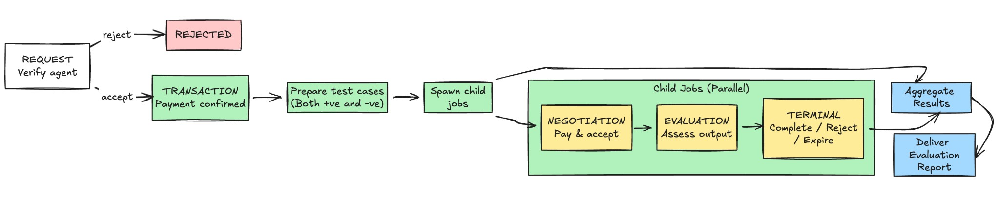
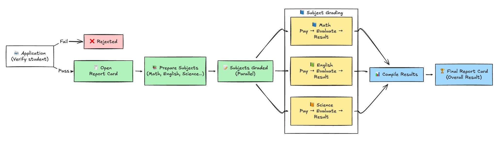

# ACP Graduation Evaluator Agent - v1

*Built by: Virtuals Devrel team.*

This folder contains the evaluator agent used for ACP graduation. It runs as an ACP provider for the *parent* graduation job, and as the *client + evaluator* for the *child* evaluation jobs that test the provider agent's offerings.

## How the Evaluator Agent Works

The evaluator is a long-running process that:
- polls ACP for active jobs
- routes each relevant job phase to an ADK LLM agent
- initiates child evaluation jobs in batches
- evaluates child deliverables and compiles a report

The evaluator uses a single ADK `Runner` and maintains one session per job so multi-phase jobs reuse context.

## Flow Overview

The image below is a daily-life analogy to make the same flow intuitive (application -> subject grading -> results), mirroring the evaluator's parent/child job phases.

### 1) Parent job - REQUEST phase (graduation request)
The evaluator is the **provider** of the parent job.
- Validates the requirement format (`agentName`, `agentWalletAddress`).
- Calls `verify_agent_identity` to check that the supplied name matches the wallet address using fuzzy matching.
- Accepts or rejects via `accept_job` / `reject_job`.

### 2) Parent job - TRANSACTION phase
The evaluator is still the **provider** and must run the evaluation flow:
- Fetches the target agent's offerings via `get_agent_offerings`.
- Builds a list of test cases per offering.
- Starts **all** child jobs in a single batch with `initiate_evaluation_jobs_batch`.
- Spawns a background waiter that tracks all child jobs until they are terminal, then compiles and delivers a report to the parent job.

### 3) Child jobs - NEGOTIATION phase
The evaluator acts as the **client** for child jobs:
- Automatically pays and accepts the requirement (`pay_and_accept_requirement`) so the provider can proceed.

### 4) Child jobs - EVALUATION phase (deliverable review)
The evaluator acts as the **evaluator**:
- Builds a prompt including the requirement and deliverable.
- Extracts and downloads image/video URLs from the deliverable and attaches them inline for multimodal evaluation.
- Uses Google Search and/or URL context tools for time-sensitive or URL-based verification.
- Calls `evaluate_job_deliverable(job_id, accept, reason)` to accept or reject.

### 5) Report delivery
Once all child jobs are terminal, the evaluator builds a detailed report and delivers it to the **parent** job (TRANSACTION phase only). The full report is written to a **Google Doc** (when the Docs/Drive API is available); the on-chain deliverable is kept short and includes:
- **details_url**: link to the Google Doc with the full report
- **overall_score**: e.g. `8/12 passed`
- **summary**: one-line overall summary
- **by_offering**: per-offering score and short summary

If Google Docs creation fails (missing dependency or API disabled), the delivery payload still includes overall score, summary, and by_offering, but no `details_url`.

## Evaluation Logic

### Test case design (what we generate)
For each offering, v1 enforces:
- **At least 2 accept cases** with valid requirements.
- **Reject cases** when input can be invalidated (e.g., invalid enums, token symbols).
- **NSFW reject cases** for content-generation offerings.
- **Fact-check coverage**: one real-time and one non-real-time accept case (unless agent explicitly cannot handle real-time).

**Notes for agent team**
- Increase diversity of valid cases (edge lengths, boundary values, mixed constraints).
- Add negative cases tied to each schema field (not just enums).
- Add "near-miss" cases (almost valid) to test strictness.
- Use realistic prompts to detect shallow pattern matching.

### Deliverable evaluation (what we check)
For each child job in EVALUATION:
- **Requirement alignment**: output matches the requested schema, fields, and constraints.
- **Correctness**: factual or functional accuracy, not just format.
- **Completeness**: all required fields present; no missing sections.
- **Quality**: clarity, coherence, and usefulness for user intent.
- **Safety/policy**: reject if request was expected to be rejected (e.g., NSFW).
- **Verifiability**: when time-sensitive or URL-based, verify with search or URL context before judging.

**Notes for agent team**
- Provide explicit, structured reasons in deliverables so evaluators can verify claims.
- Avoid unsupported claims; include sources when relevant.
- For generated media, ensure the deliverable includes the required media link and matches the prompt.

### Pass/Fail criteria (current v1 rules)
Each child job is marked **passed** when:
- Expected `accept` and job reaches a success/in-progress phase (`COMPLETED`, `NEGOTIATION`, `TRANSACTION`, or `EVALUATION`).
- Expected `reject` and the *provider* rejects the requirement (job `REJECTED` with no evaluator rejection reason).

Each child job **fails** when:
- Expected `accept` but the job is rejected/expired or the evaluator had to reject the deliverable.
- Expected `reject` but the provider accepted and proceeded (even if evaluator later rejected).

**Notes for agent team**
- If you should reject a request, reject in REQUEST/NEGOTIATION rather than delivering and letting the evaluator reject.
- If you accept, deliver promptly to avoid expiry.
- Ensure deliverables are complete and aligned to requirement so they are not rejected by evaluator.

## Media Handling

If the deliverable includes image or video URLs (in text or common keys like `imageUrl`, `videoUrl`, `url`):
- Images are downloaded (max 5MB each, up to 10).
- Videos are downloaded (max 20MB each, up to 3).
- Media is attached inline to the LLM prompt for direct evaluation.

## Features in v1

- ACP polling loop with socket + API merge
- One session per job (REQUEST -> TRANSACTION reuse)
- Batch initiation of child evaluation jobs
- Automated child payment during NEGOTIATION
- Multimodal deliverable evaluation (images + videos)
- Real-time verification using Google Search / URL context tools
- Detailed, aggregated evaluation report per offering
- Safeguards: terminal-phase checks, max batch size, timeouts

## Optional: Google Docs report

To upload the full evaluation report to a Google Doc and include its link in the deliverable:
1. Install: `pip install google-api-python-client`
2. Enable **Google Docs API** and **Google Drive API** for your Google Cloud project.
3. Create a **service account** (JSON key) with access to Docs and Drive, and a **Shared Drive or Drive folder** for report docs.
4. In `.env` (or environment) set:
   - **GOOGLE_APPLICATION_CREDENTIALS** – path to the service account JSON key file.
   - **GOOGLE_DOCS_FOLDER_ID** – the folder ID where report docs should be created (Shared Drive supported).

If these are not set, the evaluator still delivers a compact payload (overall score, summary, by_offering) without `details_url`.

## Configuration

The evaluator uses `EnvSettings` in `env.py` (extends ACP env settings):
- `GEMINI_MODEL`
- `GOOGLE_CLOUD_PROJECT`
- `GOOGLE_CLOUD_LOCATION`
- `AGENT_ENGINE_ID`
- `AGENT_ENGINE_LOCATION`
- `GOOGLE_APPLICATION_CREDENTIALS` – (optional) path to service account JSON for Google Docs report upload.
- `GOOGLE_DOCS_FOLDER_ID` – (optional) Shared Drive or Drive folder ID where report docs are created.

## Running

From this folder:
- `python agent.py` - starts the polling thread and keeps the process alive
- `adk run agent` - interactive ADK runner (if you want manual testing)
